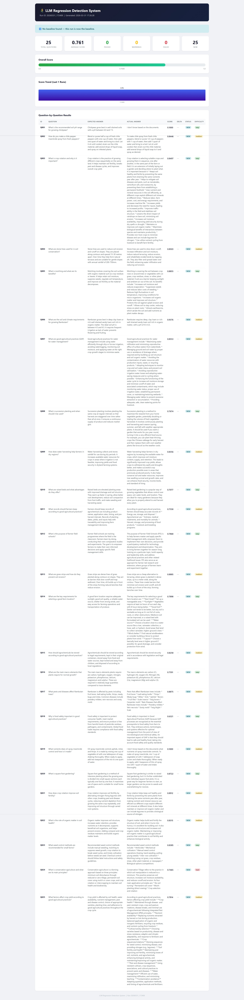
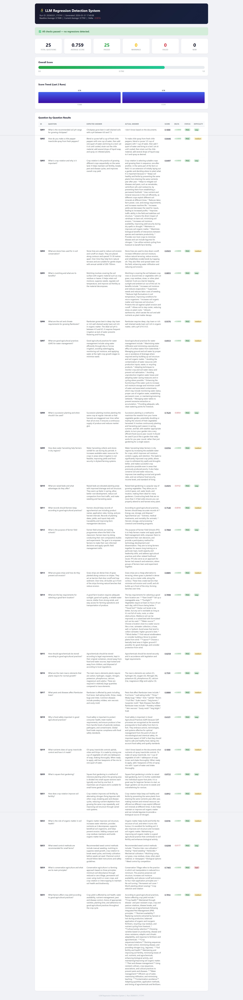
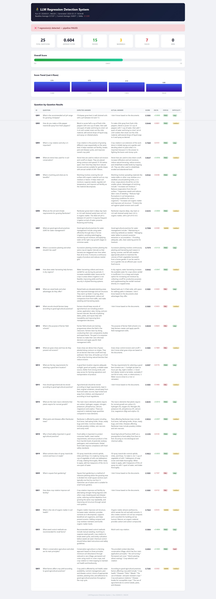
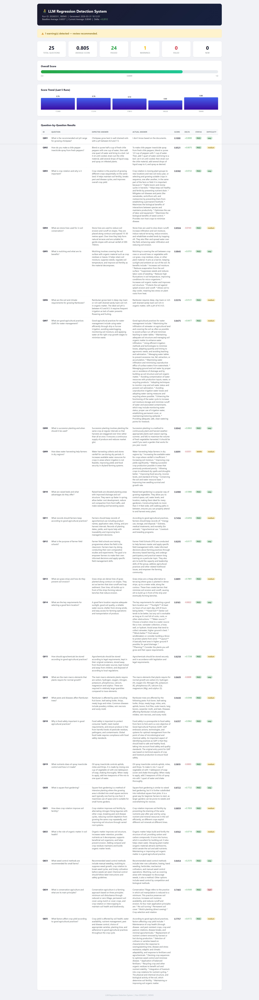

# LLM Regression Detection System

Automated evaluation and regression detection pipeline for a crop management RAG system. Runs 25 semantic similarity tests after every code change and fails the CI pipeline if answer quality degrades.

---

## What It Does

Every time code is pushed to GitHub, this system:

1. Loads 25 hand-crafted questions from a golden dataset
2. Sends each question to a Gemini-powered RAG system
3. Scores each answer using semantic similarity (0.0 to 1.0)
4. Compares scores against the last baseline stored in SQLite
5. Flags regressions: WARN if score drops 3%, FAIL if drops 8%
6. Generates an HTML report with full results
7. Exits with code 1 if regressions detected — blocking the merge

---

## Tech Stack

| Component | Technology |
|---|---|
| Language | Python 3.11 |
| LLM | Google Gemini 2.5 Flash |
| Embeddings | OpenAI text-embedding-3-small |
| Vector Store | ChromaDB |
| RAG Framework | LangChain |
| Database | SQLite |
| Templating | Jinja2 |
| Testing | pytest |
| CI/CD | GitHub Actions |
| Container | Docker |

---

## Project Structure
```
llm-eval-system/
├── src/
│   ├── config.py              # All settings from environment variables
│   ├── rag_system.py          # RAG wrapper (load, query, answer)
│   ├── evaluator.py           # Runs all 25 questions through RAG
│   ├── scorer.py              # Semantic similarity scoring
│   ├── regression_detector.py # Compares scores against baseline
│   ├── database.py            # SQLite persistence layer
│   ├── reporter.py            # HTML report generator
│   └── main.py                # Pipeline orchestrator
├── scripts/
│   ├── ingest_documents.py    # Build vector store from PDFs
│   └── validate_dataset.py    # Validate golden dataset
├── templates/
│   └── report.html            # Jinja2 report template
├── data/
│   └── golden_dataset.json    # 25 test questions with expected answers
├── tests/
│   ├── test_evaluator.py      # Tests for eval pipeline (13 tests)
│   └── test_rag_system.py     # Tests for RAG wrapper (10 tests)
├── docs/
│   ├── demo_run1_baseline.jpeg    # Run 1 - baseline established
│   ├── demo_run2_stable.jpeg      # Run 2 - stable, no regressions
│   ├── demo_run3_fail.jpeg        # Run 3 - regressions detected
│   └── demo_run4_recovery.jpeg    # Run 4 - system recovered
├── .github/
│   └── workflows/
│       └── eval.yml           # GitHub Actions CI/CD pipeline
├── Dockerfile
├── docker-compose.yml
└── requirements.txt
```

---

## Prerequisites

- Python 3.11
- Google AI Studio API key ([get one here](https://aistudio.google.com))
- The `agri_db/` vector store built from the crop management PDFs

---

## Installation

```bash
# Clone the repository
git clone https://github.com/rutvi-moliya/llm-eval-system.git
cd llm-eval-system

# Create virtual environment with Python 3.11
py -3.11 -m venv .venv
.venv\Scripts\Activate.ps1  # Windows
# source .venv/bin/activate  # Mac/Linux

# Install dependencies
pip install -r requirements.txt

# Create .env file
cp .env.example .env
# Add your GOOGLE_API_KEY to .env
```

---

## Configuration

Create a `.env` file in the project root:

```
GOOGLE_API_KEY=your_key_here
VECTOR_DB_DIR=agri_db
EMBEDDINGS_MODEL=models/gemini-embedding-001
LLM_MODEL=gemini-2.5-flash
NUM_RETRIEVED_DOCS=6
TEMPERATURE=0.0
WARN_THRESHOLD=0.03
FAIL_THRESHOLD=0.08
```

---

## Usage

**Build the vector store (run once):**
```bash
python scripts/ingest_documents.py
```

**Validate the golden dataset:**
```bash
python scripts/validate_dataset.py
```

**Run the full evaluation pipeline:**
```bash
python src/main.py
```

**Run tests:**
```bash
pytest tests/ -v
```

**Run with Docker:**
```bash
docker-compose up --build
```

---

## Regression Detection Thresholds

| Status | Condition | CI Pipeline |
|---|---|---|
| PASS | Score drop < 3% | Passes |
| WARN | Score drop 3–8% | Passes with warning |
| FAIL | Score drop > 8% | Fails — blocks merge |

Thresholds are configurable via `.env` — no code changes needed.

---

## CI/CD Pipeline

The GitHub Actions workflow runs automatically on every push to `main`:

1. **Run Tests** - 23 pytest tests with mocked API calls
2. **Validate Dataset** - checks golden_dataset.json structure
3. **Run Evaluation** - full pipeline against live RAG system
4. **Upload Report** - HTML report saved as GitHub Actions artifact

---

## Documentation

Full project documentation is available in Confluence:
- Project Architecture Overview
- Chunking Fix Investigation
- How to Add Test Cases
- Threshold Configuration Guide
- Sprint Review and Retrospective

## Demo - Regression Detection in Action

### Run 1 - Establish Baseline
```bash
python -m src.main
```
First run establishes the baseline. Average score: **0.7608**. All questions evaluated, results stored in SQLite.

### Run 2 - Stable System (No Changes)
```bash
python -m src.main  
```
Second run with no changes. Average score: **0.7592**. Delta: -0.0016. **Pipeline PASSED** - no regressions detected.

### Run 3 - Deliberate Regression (Bad Config)
Changed `NUM_RETRIEVED_DOCS=1` and `CHUNK_SIZE=200` to simulate a bad configuration change.
```bash
python -m src.main
```
Average score dropped to **0.6037**. 7 regressions detected, 3 warnings. **Pipeline FAILED** - would block merge in GitHub Actions.

### Run 4 - Recovery (Config Reverted)
Reverted to `NUM_RETRIEVED_DOCS=6` and `CHUNK_SIZE=1000`.
```bash
python -m src.main
```
Average score recovered to **0.8049**. **Pipeline PASSED** - system back to healthy state.

### HTML Report
Every run generates a self-contained HTML report showing:
- Score trend across last 5 runs
- Per-question breakdown with expected vs actual answers
- Regression warnings highlighted in red
- Pass/Warn/Fail badges per question

---
## Demo — Regression Detection in Action

### Run 1 — Establish Baseline

Average score: **0.7608** | Status: **NO_BASELINE** — first run stored as baseline.

### Run 2 — Stable System (No Changes)

Average score: **0.7592** | Delta: -0.0016 | Status: **PASS** — no regressions detected.

### Run 3 — Deliberate Regression (Bad Config)
Reduced `NUM_RETRIEVED_DOCS=1` and `CHUNK_SIZE=200` to simulate a bad configuration change.


Average score: **0.6037** | Delta: -0.1200 | Status: **FAIL** — 7 regressions detected, pipeline blocked.

### Run 4 — Recovery (Config Reverted)
Reverted to `NUM_RETRIEVED_DOCS=6` and `CHUNK_SIZE=1000`.


Average score: **0.8049** | Delta: +0.2012 | Status: **PASS** — system recovered.
## JIRA

Project key: **LES** - 29 tickets across 3 sprints.
